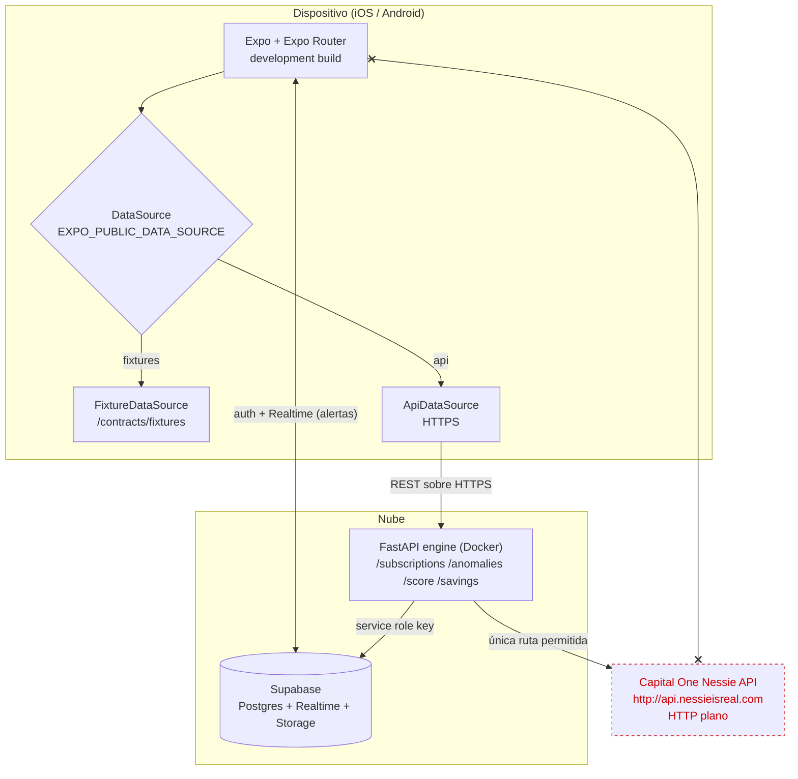
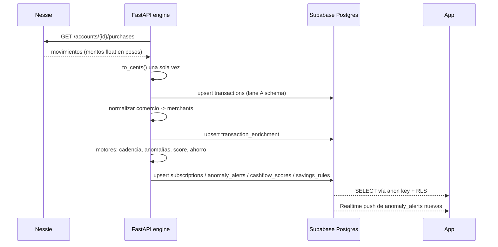
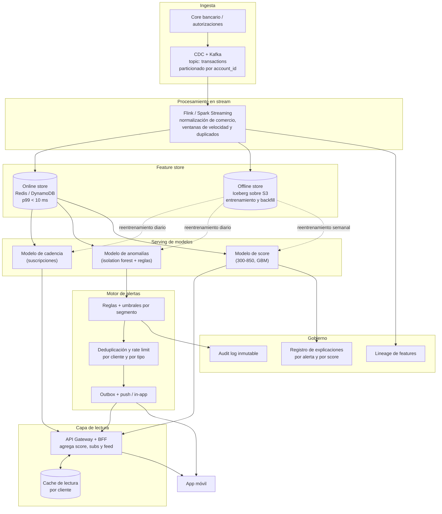

# Arquitectura — 52sec (HackMTY 2026, reto Capital One)

## Qué construimos en 36 horas

Una app bancaria móvil que lee movimientos, los normaliza por comercio y corre cuatro motores
encima: detección de suscripciones, alertas de anomalías, score de salud de flujo de efectivo y
reglas de ahorro. Nessie es la fuente externa de movimientos y **solo el backend la toca**.

**Por qué la app nunca llama a Nessie.** Nessie sirve HTTP plano. App Transport Security de iOS
bloquea HTTP por defecto; abrirle una excepción es una bandera roja en revisión y además expondría
la API key dentro del bundle. El engine habla HTTP hacia Nessie desde el servidor y HTTPS hacia la
app.

### Flujo de datos, de movimiento crudo a pantalla

## Cómo escalaría a 150 millones de clientes

Lo de 36 horas es el mismo pipeline con `for` loops y tablas. A escala Capital One, cada paso se
convierte en una etapa con su propio SLA: ingesta por stream, features materializadas, modelos
servidos aparte del motor de reglas, y alertas como cola con deduplicación.

### Qué cambia y por qué

| Pieza | 36 horas | 150 M clientes | Motivo |
|---|---|---|---|
| Ingesta | pull a Nessie bajo demanda | CDC → Kafka particionado por cuenta | pull no aguanta; el orden por cuenta importa para duplicados y velocidad |
| Enriquecimiento | función Python por lote | job de stream con estado | la normalización de comercio necesita ventanas, no un `for` |
| Features | columnas en `transaction_enrichment` | feature store online + offline | la app pide p99 bajo; el entrenamiento pide historia completa |
| Motores | reglas en el mismo proceso | modelos servidos aparte + motor de reglas | reentrenar sin redeploy del API; umbrales por segmento |
| Alertas | fila en `anomaly_alerts` | outbox con deduplicación y rate limit | sin dedupe, un comercio con retry manda 4 push al mismo cliente |
| Lecturas | `select` directo con RLS | BFF + cache por cliente | 5 pantallas × 150 M no se sirven con queries crudas |
| Explicabilidad | campo `explanation` en texto | registro de explicaciones versionado | requisito regulatorio: poder decir por qué se disparó una alerta hace 8 meses |

### Invariantes que sobreviven a los dos diagramas

- Montos como enteros en centavos. La única conversión desde float pasa por `to_cents()` en el engine.
- Fechas en ISO 8601 UTC. La zona (`America/Monterrey`, UTC-6 sin horario de verano) se aplica solo al presentar.
- Toda alerta y todo score llevan `explanation` en español; un número sin explicación no se muestra.
- El cliente nunca ve datos de otro cliente: RLS en Supabase hoy, autorización en el BFF después.
